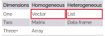
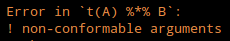
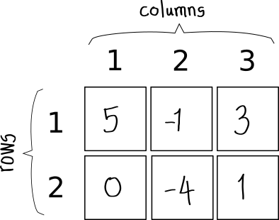
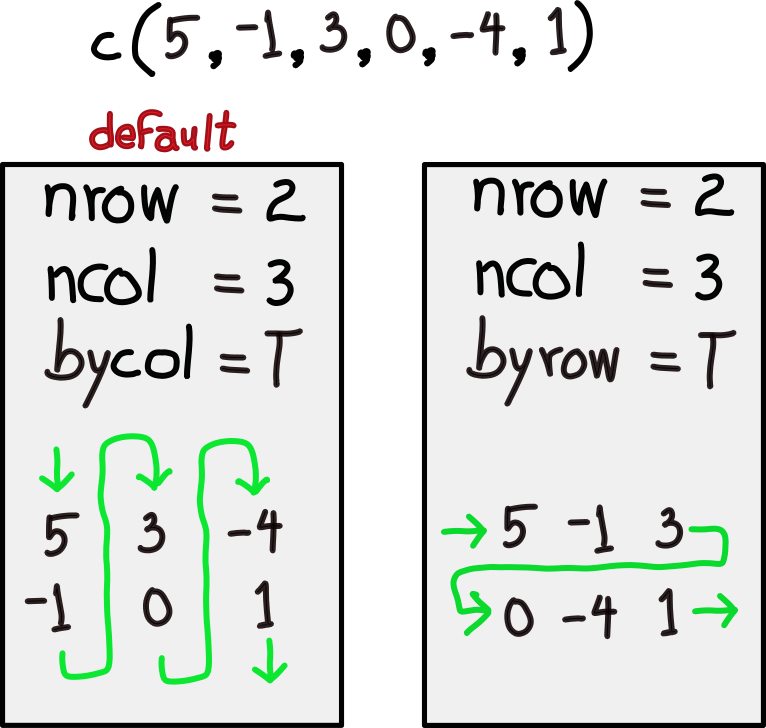
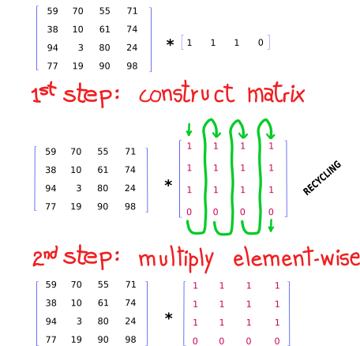

background-image: url(https://miro.medium.com/v2/resize:fit:640/format:webp/1*UH1ZkAzN4lLeWRDSggFq6Q.jpeg)
background-position: 50% 50%
background-size: 600px 485px

        
```{r setup, include=FALSE}
options(htmltools.dir.version = FALSE)
```

```{r xaringan-themer, include=FALSE, warning=FALSE}
library(xaringanthemer)
style_mono_accent(
  base_color = "#3e2f5b",
#  base_color = "#1c5253",
#  header_font_google = google_font("Josefin Sans"),
#  header_font_google = google_font("Noto Sans Japanese"),  
  header_font_google = google_font("Merriweather"),
#  text_font_google   = google_font("Montserrat", "300", "300i"),
  text_font_google   = google_font("Raleway", "400", "300i"),
#  code_font_google   = google_font("Fira Mono"),
  code_font_google   = google_font("Fira Code", "400", "500")
)
```

```{r library-setup, warning=FALSE, include=FALSE, echo=FALSE}
libraries=c("xaringanExtra", "emo")
for(lib in libraries) {
  if((lib %in% rownames(installed.packages()))) {
    do.call('library', list(lib))
  } else {
    tryCatch( 
      {install.packages(lib)}
      , warning = function (warn) {
        if ( lib == 'emo') {
          devtools::install_github("hadley/emo")
        }
      }
      , error = function(err) {
        if (lib == "emo") {
          devtools::install_github("hadley/emo")
        } else if ( lib == "xaringanExtra" ) {
          install.packages("remotes")
          remotes::install_github("gadenbuie/xaringanExtra")
        }
      }
    )
    do.call('library', list(lib))
  }
}
```

???

Image credit: [Medium.com](https://medium.com/@T45Investments/its-not-a-bug-it-s-a-feature-ca8f65a063ee)

.presenter-notes-small[The functionality of software is commonly implemented according to a specification and its complement, the use case.

Deviations from the expected or specified behaviour are called bugs.

You may think of a bug as drawing more money than the balance of your bank account, unless someone already implemented a feature called overdraft.]

---
class: center, middle

# When "by design" becomes an unsuspecting feature

### Or when ignorance is not bliss

???
  
.presenter-notes-small[We colloquially accept that perhaps we would feel more comfortable not knowing some things.

However, when it comes to your R syntax journey you will be more likely to succeed if you are fully aware of some of its key features as a computer language.
]
---

background-image: url(https://img.devrant.com/devrant/rant/r_61357_6PTYm.jpg)
background-position: 50% 50%

    
???
  
Image credit: [devrant.com](https://devrant.com/rants/61357/it-s-not-a-bug-it-s-an-undocumented-feature)

.presenter-notes-small[State of...

Left: disbelief when you first encounter coercion and recycling 

Right: disbelief when you first learn that this was done by design

Center: belief after you learn about this features and start using them productively]

---
class: center, middle

## Creative [computer language] design needs to be communicated

???
  
.presenter-notes-small[ This sentence sounds obvious, however it is not a trivial fact. R has particular ways to help humans express computation. R as a computer program enables building reproducible data pipelines, creating visualizations, train models, do complex inference, and do statistical and mathematical calculations with ease.

So let's jump into the first language feature...
]  
---
class: left, middle, inverse

#Coercion (koʊɜːʳʃən )
###uncountable noun

Coercion is the act or process of persuading someone forcefully to do something that they do not want to do.

_It was vital that the elections should be free of coercion or intimidation._

<span style="color:yellow">Synonyms:<span> force, pressure, threats, bullying

???
Source: [Collins online dictionary](https://www.collinsdictionary.com/dictionary/english/coercion)

####Emphasys on the Synonyms to transition into the next slide about bullying

---
background-image: url(https://www.memesmonkey.com/images/memesmonkey/3f/3fdbeaef7fb6720bf647b9e9e98df91d.jpeg)
background-position: 50% 50%
background-size: 600px 800px
background-color: Black
???

Image credit: [www.memesmonkey.com](https://www.memesmonkey.com/images/memesmonkey/3f/3fdbeaef7fb6720bf647b9e9e98df91d.jpeg)

#### Who does R bully/coerce and why?

#### The next slides introduce the context necessary to answer this question

---
class: middle, center, inverse

#What does R coerce and why?

---
class: left, middle
  
#R uses data types to represent values in memory


```{r eval=require('DT'), tidy=TRUE, include=TRUE, echo=FALSE}
types <- data.frame(type=c("logical", "integer", "double", "character", "complex", "raw"),
                    values=c("TRUE, T, FALSE, F", "2, 2L", "2.0, 43.9, 10", 
                               "'home', \"home2\", \"123\", \"$#.\"", 
                               "-1+i, 1i", "intToBits(2), charToRaw(\"A\")"))
#knitr::kable( types, format = "html")
DT::datatable( types, colnames = c("Type","Examples of values"), rownames = FALSE, style = 'auto')
```
???

####Everything in R is an object, and all objects have a type

.presenter-notes-small[

1. Logical

1. integer

1. double

1. character]

---
class: inverse, middle, center

##Values are stored in data structures

---
background-image: url(https://i.redd.it/31vv0v6r7qm01.jpg)
background-position: 50% 50%
background-size: contain

???
image-credit: [i.redd.it](https://i.redd.it/31vv0v6r7qm01.jpg)

.presenter-notes-small[
We deal with data structures on a daily basis, we just take them for granted!

The data structures we use in R for daily data analysis are not usually this complex.

However, they have their very specific use cases for data manipulation and algorithm implementation.
]

---
class: left, middle

#Data structures in R

```{r data structures, echo=FALSE, results='asis'}
library(knitr)
Dimensions <- c("One", "Two", "Three+")
Homogeneous <- c("Vector", "Matrix", "Array")
Heterogeneous <- c("List", "Data frame", "")

kable( data.frame(Dimensions, Homogeneous, Heterogeneous,
                  stringsAsFactors = FALSE),
       format = 'html',
       caption = "Native data structures in R according to the data type they can store and the number of dimensions they use [Advanced R, by Hadley Wickham, CRC Press, 2015, p.13].")
```
???
.presenter-notes-small[Values need containers to store them while in memory.

Data structures make this possible. Furthermore they make it expressive to operate on values.

Some data structures are designed to store values of a homogeneous type
]

---
class: top, left, bold-last-item

#What about coercion?

Coercion emerges in R when **_assigning_** values to its data structures

Two cases of interest arise:

???
#### With R's basic data types and data structures under our belt we are in a position to tackle coercion
#### Here are two examples of when it is used to decide how data is put into data structure 

--

1. Input data do not meet the requirements of the data structure

--

2. Data structure coercion


---
class: top, left
##When input data do not meet the requirements of the data structure

--
- Let's verify that a vector gets all of its elements correctly
--
```{r, define-a-vector-1, error=TRUE}
(morning_temperatures <- c(Mon=16, Tue=18, Wed=15)) 
```
--
```{r, define-a-vector-1-2, echo=c(2), highlight.output=T}
morning_temperatures <- c(Mon=16, Tue=18, Wed=15)
typeof(morning_temperatures)
```
--
```{r install-Hadley-emo, echo=FALSE, warning=FALSE, include=FALSE}
devtools::install_github("hadley/emo")
```
####`r emo::ji("+1")` `doubles` remain `doubles` after assignment 

---

##When input data do not meet the requirements of the data structure

--
- Now let's try with heterogeneous input...

```{r, define-a-vector2, error=TRUE, tidy.opts = list(blank = T, width.cutoff = 90)}
(morning_temperatures <- c(Mon=16, Tue=18, Wed="15C")) 
```
--

```{r, define-a-vector2-2, echo=c(2), highlight.output=T}
morning_temperatures <- c(Mon=16, Tue=18, Wed="15C")
typeof(morning_temperatures)
```
--

####`r emo::ji("open_mouth")` Yes, a vector is designed to store elements of the same type.

--


---
class: left,top

##What is the logic behind this design?

--

####To fight entropy

--

<div class="tenor-gif-embed" data-postid="11277911" data-share-method="host" data-aspect-ratio="1" data-width="50%"><a href="https://tenor.com/view/good-place-michael-entropy-pointless-gif-11277911">Good Place Michael GIF</a>from <a href="https://tenor.com/search/good+place-gifs">Good Place GIFs</a></div> <script type="text/javascript" async src="https://tenor.com/embed.js"></script>

???
.presenter-notes-small[Ted Danson starring Michael in an episode of "The Good Place" (2016–2020)

The Good Place is a town where those who have been good throughout their lives go once they have passed away. Michael (Danson) is the architect who oversees the town--and this is the first one he has been in charge of creating. Eleanor (Bell) arrives at the Good Place and realizes they have her name right, but everything else is wrong. She isn't meant to be there at all. With the help of Chidi, her soul mate (Harper), Eleanor tries to right her wrongs, seeking to finally earn her spot in the Good Place]

---
class: left, top
#Types are hierarchical 

--
####Types go from specific to general:
--

.pull-left[

```{r, less-to-more-general,echo=FALSE}
library(ggplot2)
library(data.table)
datat <- data.table(types=factor(c("logical", "integer", "integer","double","double","character"), levels =  c("logical","integer","double","character"), ordered = TRUE), how_general=factor(c("most specific","somewhat specific","somewhat specific","somewhat general","somewhat general","most general"), levels=c("most specific", "somewhat specific", "somewhat general", "most general"), ordered = TRUE), transition=c("to_integer","to_integer","to_double","to_double","to_character","to_character"))
ggplot(datat, aes(x=types, y= how_general, group=transition, color=transition))  + geom_line(arrow = arrow(type = "closed" ), linewidth = 1.75) + geom_point(size = 5, color = "red") + theme(text = element_text(size = 20), axis.text.y = element_text(angle = 0, hjust = 1), axis.text.x = element_text(angle = 45, hjust = 1), axis.title = element_blank()) 
  
```
]
--
.pull-right[

1. <span style="color:blue">Every<span> **<span style="color:blue">logical<span>** <span style="color:blue">can be mapped to an<span> **<span style="color:blue">integer<span>**

1. <span style="color:green">Every<span> **<span style="color:green">integer<span>** <span style="color:green">can be mapped to a<span> **<span style="color:green">double<span>**

1. <span style="color:red">Every<span> **<span style="color:red">double<span>** <span style="color:red">can be mapped to a<span> **<span style="color:red">character<span>**

Reversing these statements is impossible!
]

--


???

image-source: [https://assets.bwbx.io/](https://assets.bwbx.io/images/users/iqjWHBFdfxIU/iLsvH3JlemBk/v0/-1x-1.jpg)

---

class: left, top, highlight-last-item

##R coerces to preserve information

--

Given a choice among heterogeneous types to store in a vector...

--

R chooses the most general type

--

###This choice minimizes information loss

--

And that can be a 


???

### Elements of heterogenous data types into a data structure that requires elements of a homogenoeus type

### R makes the best decision possible

### The most general data type preserves information

---

###An experiment to show the 


--

```{r, example-ceorcion-in-vector-assignment, echo=TRUE, highlight.output=T}
(pm_avg_temps <- c(15.3, 10, 20.1, 16.5, "12.8am", 17.2, 19.9))
```

--

Now let's try to reverse the process with our own coercion

--

```{r, example-coercion-in-vector-reverse, echo=TRUE, echo=c(2), highlight.output=T}
pm_avg_temps <- c(15.3, 10, 20.1, 16.5, "12.8am", 17.2, 19.9)
(avg_temps <- as.double(pm_avg_temps))
```

--

####The net effect is introducing `missing values`

If we were to impute them, it'd be harder because we have lost the original context. 


???

## All elements are coerced by R into characters, the most general type

## Recover the numbers 

## NAs are created by the reverse coercion (Not Applicable is different from NaN)

## that is information loss

---
class: left, top, show-only-last-code-result

###Another reason R coerces without warning

- Data structure coercion


--

```{r, appending-to-lists, tidy=FALSE, highlight.output=T}
(party_plan <- c(items=list( furniture=c("chairs", "tables", "hammocks"),
                             drinks=c("pop", "beer", "wine", "water") ),
               guests=c("Uncle Bob","Friendly neighbour", "Joe Best")))
```

???
.presenter-notes-small[ 

We will use a vector constructor to append a vector to a list.

The result could be a vector or a list.

The coercion from vector into list is not about the types of the individual elements. They are all of the same type, "character".

It's about chosing a more general data structure: a list can contain a vector but not the other way around!

Let's remember or basic R data structures: they also have a hierarchy!
]

--

```{r, class-of-result, tidy=TRUE, echo=c(2), highlight.output=T}
(party_plan <- c(items=list( furniture=c("chairs", "tables", "hammocks"),drinks=c("pop", "beer", "wine", "water") ),guests=c("Uncle Bob","Friendly neighbour", "Joe Best")))
typeof(party_plan)
```

--

```{r, typeof-each-element, tidy=TRUE, echo=c(2), highlight.output=T}
(party_plan <- c(items=list( furniture=c("chairs", "tables", "hammocks"),drinks=c("pop", "beer", "wine", "water") ),guests=c("Uncle Bob","Friendly neighbour", "Joe Best")))
c(typeof(party_plan$items.furniture), typeof(party_plan$items.drinks), typeof(party_plan$guests1), typeof(party_plan$guests2), typeof(party_plan$guests3))
```

--



---
class: left, middle, inverse

#Recycle (riːsaɪkəl)

###transitive verb

1: to pass again through a series of changes or treatments: such as
     to save from loss and restore to usefulness, reclaim

4: to make ready for reuse

  _a plan to recycle vacant apartment buildings_

???
Source: [Merriam Webster''s online Dictionary](https://www.merriam-webster.com/dictionary/recycle)

.presenter-notes-small[

The key of recycling idea is to save from loss and to make useful what could be a reject!

]

---
background-image: url(https://i.pinimg.com/736x/8a/3f/e8/8a3fe88ce369c46593ddcbf80b2570ce--really-funny-pictures-funniest-pictures.jpg)
background-position: 50% 50%
background-size: 680px 680px
background-color: Black 

???
image credit: [i.pinimg.com](https://i.pinimg.com/736x/8a/3f/e8/8a3fe88ce369c46593ddcbf80b2570ce--really-funny-pictures-funniest-pictures.jpg)

####No further words needed. R wants to be economical!

---
class: top, left, show-only-last-code-result

##The Baker's budget

```{r weekly-ingredients, tidy=TRUE, highlight.output=T}
(weekly_materials <- c(flour_kg = 12, eggs_units = 450, yeast_kg = 5, salt_kg = 0.350))
```

--
```{r weeks-per-year, tidy=TRUE, highlight.output=T}
(weeks_per_year <- rep(52.18, 4))
```

--

```{r annual-budget, tidy=TRUE, highlight.output=T, echo=c(3)}
weekly_materials <- c(flour_kg = 12, eggs_units = 450, yeast_kg = 5, salt_kg = 0.350)
weeks_per_year <- rep(52.18, 4)
(annual_materials <- weekly_materials * weeks_per_year)
```

???
.presenter-notes-small[

R is a vectorized language.

Here we are doing element-wise vector multiplication.

]


---
class: top, left, show-only-last-code-result

##The Special Week Baker's budget 

```{r cake-ingredients, tidy=TRUE, highlight.output=T}
special_cake_contract_week <- c(flour=1.2, eggs=1.3, yeast=1.2, salt=1)
```

--

```{r average-weekly-ingredients, tidy=TRUE, highlight.output=T, echo=c(2)}
weekly_materials <- c(flour_kg = 12, eggs_units = 450, yeast_kg = 5, salt_kg = 0.350)
weekly_materials
```


--
```{r special-cake-budget, tidy=TRUE, highlight.output=T, echo=c(3)}
weekly_materials <- c(flour_kg = 12, eggs_units = 450, yeast_kg = 5, salt_kg = 0.350)
special_cake_contract_week <- c(flour=1.2, eggs=1.3, yeast=1.2, salt=1)
(cake_week_materials <- weekly_materials * special_cake_contract_week )
```

--

```{r difference-annual-special-budget, tidy=TRUE, highlight.output=T, echo=c(4)}
weekly_materials <- c(flour_kg = 12, eggs_units = 450, yeast_kg = 5, salt_kg = 0.350)
special_cake_contract_week <- c(flour=1.2, eggs=1.3, yeast=1.2, salt=1)
cake_week_materials <- weekly_materials * special_cake_contract_week 
(cake_week_materials > weekly_materials )
```


???
.presenter-notes-small[

A contract came in to make cakes for a week.

The baker needs to estimate the materials he will require to make his regular production plus the additional cakes.

And after computing it we answer the question: "what materials will we require more of to meet that cake contract for a week?".

Why am I presenting this story to you?

]


---
class: top, left, show-only-last-code-result

##What if we made a typo?

```{r cake-ingredients-typo, tidy=TRUE, highlight.output=T}
(special_cake_contract_week <- c(flour=1.2, eggs=1.3, yeast=1.2))
```

--
```{r special-cake-budget-typo, tidy=TRUE, highlight.output=T, echo=c(3)}
weekly_materials <- c(flour_kg = 12, eggs_units = 450, yeast_kg = 5, salt_kg = 0.350)
special_cake_contract_week <- c(flour=1.2, eggs=1.3, yeast=1.2)
(cake_week_materials <- weekly_materials * special_cake_contract_week )
```

--

```{r difference-annual-special-budget-typo, tidy=TRUE, highlight.output=T, echo=c(4)}
weekly_materials <- c(flour_kg = 12, eggs_units = 450, yeast_kg = 5, salt_kg = 0.350)
special_cake_contract_week <- c(flour=1.2, eggs=1.3, yeast=1.2)
cake_week_materials <- weekly_materials * special_cake_contract_week 
(cake_week_materials > weekly_materials )
```

--

```{r verifying-weekly-materials, echo=c(4,5), highlight.output=T, tidy=TRUE}
weekly_materials <- c(flour_kg = 12, eggs_units = 450, yeast_kg = 5, salt_kg = 0.350)
special_cake_contract_week <- c(flour=1.2, eggs=1.3, yeast=1.2)
cake_week_materials <- weekly_materials * special_cake_contract_week 
list(average_week=weekly_materials, cake_week=cake_week_materials)
```


???
.presenter-notes-small[

Element-wise vector multiplication requires the same number of elements in each vector.

R will reuse your input to minimise waste.

The part that is surprising here is that in most other computer languages this would cause an error.

]

---
class: left, middle, highlight-last-item, design-decision-bug_background


- Element-wise vector multiplication requires the same number of elements in each vector.

--

- R reuses your input to minimise waste.

--

- The _waste_ might be the cognitive overload from having to write large, repetitive data structures   

--

- This is a **language design** decision


--

- Recycling suits a natively vectorized data-processing language like R

--

- Once you know recycling exists it becomes a very useful feature


---

<div style="width:100%;height:0;padding-bottom:56%;position:relative;"><iframe src="https://giphy.com/embed/px9yz9t1lHPNHjQWA9" width="110%" height="110%" style="position:absolute" frameBorder="0" class="giphy-embed" allowFullScreen></iframe></div><p><a href="https://giphy.com/gifs/nascar-racing-2021-motorsports-px9yz9t1lHPNHjQWA9">via GIPHY</a></p>

###Learning R and starting a race car...

???
Image-credit: url('https://giphy.com/gifs/nascar-racing-2021-motorsports-px9yz9t1lHPNHjQWA9')

---

class: center, middle, inverse

##They may require an initial push...

---

class: top, left, show-only-last-code-result

##Element-wise Vs. dot product

```{r element-wise-vector-product-setup-A, echo=T, tidy=T, highlight.output=T}
(A <- c(1, 0, 2)) # [A]_3x1
```

--

```{r element-wise-vector-product-setup-B, echo=T, tidy=T, highlight.output=T}
(B <- c(3, 3, 3)) # [B]_3x1
```

--

```{r element-wise-vector-product, echo=c(3), tidy=T, highlight.output=T}
A <- c(1, 0, 2)
B <- c(3, 3, 3)
A * B             # [A]_3x1 x [B]_3x1 = [AB]_3x1
```


--

```{r inner-dot-vector-product, echo=c(3), tidy=T, highlight.output=T}
A <- c(1, 0, 2)
B <- c(3, 3, 3)
t(A) %*% B        # [A]_1x3 . [B]_3x1 = [AB]_1x1
```


--

```{r outer-dot-vector-product, echo=c(3), tidy=T, highlight.output=T}
A <- c(1, 0, 2)
B <- c(3, 3, 3)
A %*% t(B)        # [A]_3x1 . [B]_1x3 = [AB]_3x3

```


---

class: top, left, show-only-last-code-result

###Element-wise Vs. dot product (Recycled)

```{r element-wise-vector-product-setup-A-recycle, echo=T, tidy=T, highlight.output=T}
(A <- c(1, 0, 2)) # [A]_3x1
```

--

```{r element-wise-vector-product-setup-B-recycle, echo=T, tidy=T, highlight.output=T}
(B <- c(3, 3)) # [B]_2x1
```

--

```{r element-wise-vector-product-recycle, echo=c(3), tidy=T, highlight.output=T}
A <- c(1, 0, 2)
B <- c(3, 3)
A * B             # [A]_3x1 x [B]_2x1 = [AB]_3x1
```


--

```{r inner-dot-vector-product-recycle, include=TRUE, eval=FALSE, highlight.output=T, tidy=T}
A <- c(1, 0, 2)
B <- c(3, 3)
t(A) %*% B        # [A]_1x3 . [B]_2x1 = [AB]_1x1
```

     
--

```{r outer-dot-vector-product-recycle, eval=TRUE, include=TRUE, highlight.output=T, tidy=T}
A <- c(1, 0, 2)
B <- c(3, 3)
A %*% t(B)        # [A]_3x1 . [B]_1x2 = [AB]_3x3
```


---
class: top, left, show-only-last-code-result

##Matrix construction 101

- To build a matrix like this:




- In R we create a matrix with the built-in function `matrix()`:

--

```{r matrix-constructor, echo=T, tidy=T, highlight.output=T}
matrix(c(5, -1, 3, 0, -4, 1), ncol = 3, nrow = 2, byrow = T)
```

---
class: top, left, show-only-last-code-result

##Matrix construction 101

- By default `matrix()` will use the vector to fill in the matrix in **column order**:

--

```{r matrix-constructor-column-order, echo=T, tidy=T, highlight.output=T}
matrix(c(5, -1, 3, 0, -4, 1), ncol = 3, nrow = 2)
```

--

- This is a _different_ matrix from the one we wanted:


---
class: top, center

###Column Vs row-oriented construction



---
background-image: url(https://i.pinimg.com/736x/8a/3f/e8/8a3fe88ce369c46593ddcbf80b2570ce--really-funny-pictures-funniest-pictures.jpg)
background-position: 50% 50%
background-size: 680px 680px
background-color: Black 

???
image credit: [i.pinimg.com](https://i.pinimg.com/736x/8a/3f/e8/8a3fe88ce369c46593ddcbf80b2570ce--really-funny-pictures-funniest-pictures.jpg)

---

class: top, left, show-only-last-code-result

###The "waste" minimization example

--

```{r mask-generation, highlight.output=T, tidy=T}
set.seed(673912) # arbitrary number for reproducible results
(values <- sample.int(n = 99, size = 16, replace = TRUE))
```
--

```{r populate-matrix-random-numbers, echo=c(3), tidy=T, highlight.output=TRUE}
set.seed(673912) # arbitrary number for reproducible results
values <- sample.int(n = 99, size = 16, replace = TRUE)
(m <- matrix(values, nrow = 4))
```

--

```{r populate-matrix-create-mask, echo=c(4), tidy=T, highlight.output=TRUE}
set.seed(673912) # arbitrary number for reproducible results
values <- sample.int(n = 99, size = 16, replace = TRUE)
m <- matrix(values, nrow = 4)
( zero_to_4th_row <- c(1,1,1,0) )
```

--

```{r populate-matrix-apply-mask, echo=c(5), tidy=T, highlight.output=TRUE}
set.seed(673912) # arbitrary number for reproducible results
values <- sample.int(n = 99, size = 16, replace = TRUE)
m <- matrix(values, nrow = 4)
zero_to_4th_row <- c(1,1,1,0)
m * zero_to_4th_row        # [m]_4x4 x [mask]_4x1 = ??
```


???

.presenter-notes-small[

This example describes why recycling suits vectorized operations and data structures.

How did this work?

Matrix multiplication does not work like that!

]

---

class: center, top

###Mask application explained (by recycling)

.center2[

]


---
class: left, middle, inverse

#Sub-setting

###noun

The production of a subset. 

#Subset

###noun

A set whose members are members of another set; a set contained within another set

???
Source: [Wiktionary](https://www.wordnik.com/words/subset)

[From WordNet 3.0 Copyright 2006 by Princeton University. All rights reserved](https://www.wordnik.com/words/subset)


---
background-image: url(http://www.quickmeme.com/img/06/06d85daad5e49420eee5ccefd597782ca7ad37c03a306458f5ee865e6d22a5b6.jpg)
background-position: 50% 50%
background-size: contain 
background-color: LightGreen

???
Image credit: [http://www.quickmeme.com](http://www.quickmeme.com/img/06/06d85daad5e49420eee5ccefd597782ca7ad37c03a306458f5ee865e6d22a5b6.jpg)

---
class: top, left, show-only-last-code-result

#Vector subsetting

- R is a vectorized language. There are no scalars.
--

```{r vectorized, highlight.output=TRUE}
A <- 1
is.vector(A)
```
--
- Subsetting by position:

```{r subset-by-position-setup-pos, highlight.output=TRUE}
(X <- c(5, -1, 3, 0, -4, 1))   # a vector with 6 elements
```
--
```{r subset-by-position, highlight.output=TRUE, echo=c(2)}
X <- c(5, -1, 3, 0, -4, 1)
X[1]     # In R, positions in a vector start at 1
```

--
```{r subset-by-position-sequence, highlight.output=TRUE, echo=c(2)}
X <- c(5, -1, 3, 0, -4, 1)
X[1:3]     # the first three elements
```
--
```{r subset-by-position-vector-of-positions, highlight.output=TRUE, echo=c(2)}
X <- c(5, -1, 3, 0, -4, 1)
X[c(1,3,6)]     # the first, third, and sixth elements
```

---
class: top, left, show-only-last-code-result

#Vector subsetting (cont.)

- Subsetting by excluding positions:

--

```{r subset-by-position-excluding-pos-setup, highlight.output=TRUE, echo=T}
(X <- c(5, -1, 3, 0, -4, 1))
```

--

```{r subset-by-position-excluding-pos, highlight.output=TRUE, echo=c(2)}
X <- c(5, -1, 3, 0, -4, 1)
X[-1]     # all but the first
```

--

```{r subset-by-position-excluding-pos-vector, highlight.output=TRUE, echo=c(2)}
X <- c(5, -1, 3, 0, -4, 1)
X[c(-1,-6)]     # all but the first and last
```

---
class: top, left, show-only-last-code-result

#Vector subsetting

- Subsetting by logical masks:

```{r subset-by-position-setup-logical-mask, highlight.output=TRUE}
(X <- c(5, -1, 3, 0, -4, 1))   # a vector with 6 elements
```

--

```{r subset-by-logical-mask-creation, highlight.output=TRUE, echo=c(2)}
X <- c(5, -1, 3, 0, -4, 1)
( is_positive <- c( X > 0 ) )
```
--

```{r subset-by-logical-mask, highlight.output=TRUE, echo=c(3)}
X <- c(5, -1, 3, 0, -4, 1)
is_positive <- c( X > 0 )
X[is_positive]
```

---
class: top, left, show-only-last-code-result

#Matrix subsetting

---
class: top, left, show-only-last-code-result

#List subsetting

---
class: top, left, show-only-last-code-result

#Data frame subsetting

---

class: center, middle

# Thanks!

### Slides coerced, recycled, and subset via the R packages [**xaringan**](https://github.com/yihui/xaringan) and  [**xaringanthemer**](https://pkg.garrickadenbuie.com/xaringanthemer/)

