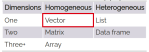

background-image: url(https://miro.medium.com/v2/resize:fit:640/format:webp/1*UH1ZkAzN4lLeWRDSggFq6Q.jpeg)
background-position: 50% 50%
background-size: 600px 485px

        
```{r setup, include=FALSE}
options(htmltools.dir.version = FALSE)
```

```{r xaringan-themer, include=FALSE, warning=FALSE}
library(xaringanthemer)
style_mono_accent(
  base_color = "#3e2f5b",
#  base_color = "#1c5253",
#  header_font_google = google_font("Josefin Sans"),
#  header_font_google = google_font("Noto Sans Japanese"),  
  header_font_google = google_font("Merriweather"),
#  text_font_google   = google_font("Montserrat", "300", "300i"),
  text_font_google   = google_font("Raleway", "400", "300i"),
#  code_font_google   = google_font("Fira Mono"),
  code_font_google   = google_font("Fira Code", "400", "500")
)

```
```{r, xaringan-Extras, echo=FALSE}
library("xaringanExtra")
```

???

Image credit: [Medium.com](https://medium.com/@T45Investments/its-not-a-bug-it-s-a-feature-ca8f65a063ee)

.presenter-notes-small[The functionality of software is commonly implemented according to a specification or its complement, the use case.

Deviations from the expected or specified behaviour are called bugs.

You may think of a bug as drawing more money than the balance of your bank account, unless someone already implemented a feature called overdraft.]

---
class: center, middle

# When "by design" becomes an unsuspecting feature

### Or when ignorance is not bliss

???
  
.presenter-notes-small[We colloquially accept that perhaps we would feel more comfortable not knowing some things.

However, when it comes to R syntax you will be more likely to succeed if you are fully aware of some of its key language features.
]
---

background-image: url(https://img.devrant.com/devrant/rant/r_61357_6PTYm.jpg)
background-position: 50% 50%

    
???
  
Image credit: [devrant.com](https://devrant.com/rants/61357/it-s-not-a-bug-it-s-an-undocumented-feature)

.presenter-notes-small[State of...

Left: disbelief when you first encounter coercion and recycling 

Right: disbelief when you first learn that this was done by design

Center: belief after you learn about this features and start using them productively]

---
class: center, middle

## Creative [computer language] design needs to be communicated

???
  
.presenter-notes-small[Communicated is an euphemism for "taught" because we are not born using computer languages the way we use human languages]  

---
class: left, middle, inverse

#Coercion (koʊɜːʳʃən )
###uncountable noun

Coercion is the act or process of persuading someofne forcefully to do something that they do not want to do.

_It was vital that the elections should be free of coercion or intimidation._

<span style="color:yellow">Synonyms:<span> force, pressure, threats, bullying

???
Source: [Collins online dictionary](https://www.collinsdictionary.com/dictionary/english/coercion)

####Emphasys on the Synonyms to transition into the next slide about bullying

---
background-image: url(https://www.memesmonkey.com/images/memesmonkey/3f/3fdbeaef7fb6720bf647b9e9e98df91d.jpeg)
background-position: 50% 50%
background-size: 600px 800px
background-color: Black
???

Image credit: [www.memesmonkey.com](https://www.memesmonkey.com/images/memesmonkey/3f/3fdbeaef7fb6720bf647b9e9e98df91d.jpeg)

#### Who does R bully/coerce and why?

#### The next slides introduce context necessary to answer this

---
class: left, middle
  
#Data types in R

The fundamental values that R represents and manipulates in the computer memory:
  
```{r eval=require('DT'), tidy=TRUE, include=TRUE, echo=FALSE}
types <- data.frame(type=c("logical", "integer", "double", "character", "complex", "raw"),
                    examples=c("TRUE, T, FALSE, F", "2, 2L", "2.0, 43.9, 10", 
                               "'home', \"home2\", \"123\", \"$#.\"", 
                               "-1+i, 1i", "intToBits(2), charToRaw(\"A\")"))
#knitr::kable( types, format = "html")
DT::datatable( types, rownames = FALSE)
```
???

###Every R object has a type

Logical, integer, double, character

---
class: left, middle

#Data structures in R

```{r data structures, echo=FALSE, results='asis'}
library(knitr)
Dimensions <- c("One", "Two", "Three or more")
Homogeneous <- c("Vector", "Matrix", "Array")
Heterogeneous <- c("List", "Data frame", "")

kable( data.frame(Dimensions, Homogeneous, Heterogeneous,
                  stringsAsFactors = FALSE),
       caption = 'Native data structures in R according to the data type they can store and the number of dimensions they use [Advanced R, by Hadley Wickham, CRC Press, 2015, p.13].')
```
???
.presenter-notes-small[Values are stored in data structures to keep them organized in memory

Data structures make it easier to operate on values

I will highlight that some data structures are designed to store homogeneous data types
]

---
background-image: url(https://i.redd.it/31vv0v6r7qm01.jpg)
background-position: 50% 50%
background-size: contain

???
image-credit: [i.redd.it](https://i.redd.it/31vv0v6r7qm01.jpg)

.presenter-notes-small[
We deal with data structures on a daily basis, we just take them for granted!
]


---
class: top, left

#What about coercion?

Coercion emerges in R when assigning values to its data structures

Two cases of interest arise:

--

1. Input data do not meet the requirements of the data structure

--

2. Input data type is unspecified

???
#### With R's basic data types and data structures under our belt we are in a position to tackle coercion
#### Here are two examples of when it is used to decide how data is put into data structure 

---
class: top, left
##Input data do not meet the requirements of the data structure

--
- Let's verify that a vector gets all of its elements correctly
--
```{r, define-a-vector-1, error=TRUE}
(morning_temperatures <- c(Mon=16, Tue=18, Wed=15)) 
```
--
```{r, define-a-vector-1-2, echo=c(2), highlight.output=T}
morning_temperatures <- c(Mon=16, Tue=18, Wed=15)
typeof(morning_temperatures)
```


---

##Input data do not meet the requirements of the data structure

--
- Now let's try with heterogeneous input...

```{r, define-a-vector2, error=TRUE, tidy.opts = list(blank = T, width.cutoff = 90)}
(morning_temperatures <- c(Mon=16, Tue=18, Wed="15C")) 
```
--

```{r, define-a-vector2-2, echo=c(2), highlight.output=T}
morning_temperatures <- c(Mon=16, Tue=18, Wed="15C")
typeof(morning_temperatures)
```
--

A vector is designed to store elements of the same type.

--


---
class: left, top

#What is the logic behind this design?

To fight entropy

<div class="tenor-gif-embed" data-postid="11277911" data-share-method="host" data-aspect-ratio="1" data-width="50%"><a href="https://tenor.com/view/good-place-michael-entropy-pointless-gif-11277911">Good Place Michael GIF</a>from <a href="https://tenor.com/search/good+place-gifs">Good Place GIFs</a></div> <script type="text/javascript" async src="https://tenor.com/embed.js"></script>


---
class: left, top
#A data type hierarchy 

--
Types range from less to more general:
--

.pull-left[

```{r, less-to-more-general,echo=FALSE}
library(ggplot2)
library(data.table)
datat <- data.table(types=factor(c("logical", "integer", "integer","double","double","character"), levels =  c("logical","integer","double","character"), ordered = TRUE), how_general=factor(c("most specific","somewhat specific","somewhat specific","somewhat general","somewhat general","most general"), levels=c("most specific", "somewhat specific", "somewhat general", "most general"), ordered = TRUE), transition=c("to_integer","to_integer","to_double","to_double","to_character","to_character"))
ggplot(datat, aes(x=types, y= how_general, group=transition, color=transition))  + geom_line(arrow = arrow(type = "closed" ), linewidth = 1.75) + geom_point(size = 5, color = "red") + theme(text = element_text(size = 20), axis.text.y = element_text(angle = 0, hjust = 1), axis.text.x = element_text(angle = 45, hjust = 1), axis.title = element_blank()) 
  
```
]
--
.pull-right[

1. Every logical can be mapped to an integer

1. Every integer can be mapped to a double

1. Every double can be mapped to a character

Reversing these statements is impossible!

]
--


???

image-source: [https://assets.bwbx.io/](https://assets.bwbx.io/images/users/iqjWHBFdfxIU/iLsvH3JlemBk/v0/-1x-1.jpg)

---

class: left, top, highlight-last-item

#R coerces to preserve information

--

Given a choice among heterogeneous types to store in a vector...

--

R will choose the most general type

--

###R will make the choice that minimizes information loss

--

And that can be a 


???

### Elements of heterogenous data types into a data structure that requires elements of a homogenoeus type

### R makes the best decision possible

### The most general data type preserves information

---

##R coerces if pushed into a corner.

--

```{r, example-ceorcion-in-vector-assignment, echo=TRUE, highlight.output=T}
(temps <- c(15.3, 10.7, 20.1, 16.5, "12.8C", 17.2, 19.9))
```

--

Now let's try to reverse the process with our own coercion


```{r, example-coercion-in-vector-reverse, echo=TRUE, echo=c(2), highlight.output=T}
temps <- c(15.3, 10.7, 20.1, 16.5, "12.8C", 17.2, 19.9)
as.double(temps)
```

--

The net effect is missing values in the vector.

If we were to impute the missing value, it'd be harder because we have lost the original context. 


???

## All elements are coerced by R into characters, the most general type

## Recover the numbers 

## NAs are created by the reverse coercion

## that is information loss


---
class: left, top

#Reasons R coerces data types without warning

- A data structure makes assumptions for you
--
```{r, df-turns-characters-into-factors, tidy=FALSE}
df <- data.frame(temperatures=c(16, 18, 15, 6, 10),
                time_of_day=c("AM", "PM", "AM", "AM", "PM"))
str(df)
```

---
class: left, middle, inverse

#Recycle (riːsaɪkəl)

###transitive verb

1: to pass again through a series of changes or treatments: such as
     to save from loss and restore to usefulness, reclaim

4: to make ready for reuse

  _a plan to recycle vacant apartment buildings_

???
Source: [Merriam Webster''s online Dictionary](https://www.merriam-webster.com/dictionary/recycle)
---
background-image: url(https://i.pinimg.com/736x/8a/3f/e8/8a3fe88ce369c46593ddcbf80b2570ce--really-funny-pictures-funniest-pictures.jpg)
background-position: 50% 50%
background-size: 680px 680px
background-color: Black 

???
image credit: [i.pinimg.com](https://i.pinimg.com/736x/8a/3f/e8/8a3fe88ce369c46593ddcbf80b2570ce--really-funny-pictures-funniest-pictures.jpg)

---
class: left, middle, inverse

#Subsetting

###noun

The production of a subset. 

#Subset

###noun

A set whose members are members of another set; a set contained within another set

???
Source: [Wiktionary](https://www.wordnik.com/words/subset)

[From WordNet 3.0 Copyright 2006 by Princeton University. All rights reserved](https://www.wordnik.com/words/subset)
---
background-image: url(http://www.quickmeme.com/img/06/06d85daad5e49420eee5ccefd597782ca7ad37c03a306458f5ee865e6d22a5b6.jpg)
background-position: 50% 50%
background-size: contain 
background-color: LightGreen

???
Image credit: [http://www.quickmeme.com](http://www.quickmeme.com/img/06/06d85daad5e49420eee5ccefd597782ca7ad37c03a306458f5ee865e6d22a5b6.jpg)

---

class: center, middle

# Thanks!

### Slides coerced, recycled, and subsetted via the R packages [**xaringan**](https://github.com/yihui/xaringan) and  [**xaringanthemer**](https://pkg.garrickadenbuie.com/xaringanthemer/)

